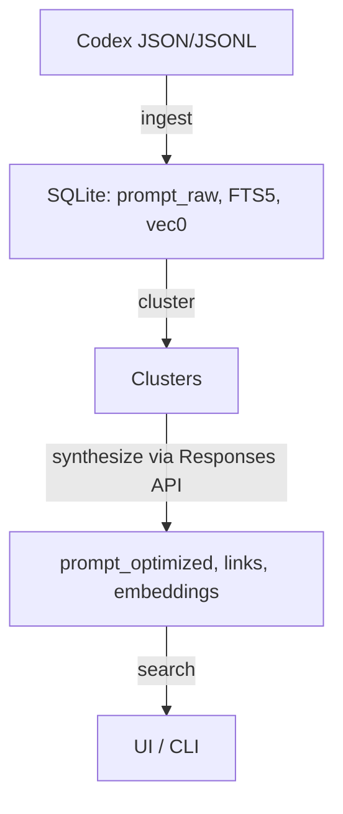

# Codex Prompt Refinery

Local-first tool that ingests **OpenAI Codex CLI** histories (`~/.codex/**`), deduplicates and clusters related prompts, and auto-synthesizes **atomic** and **workflow** prompts via the **OpenAI Responses API** with **Structured Outputs**. Stores everything in one **SQLite** database with **FTS5** keyword search and **sqlite-vec** semantic search. Ships a minimal **Streamlit** UI and a **Typer** CLI. Optional **systemd** timer for daily automation on WSL2.

- Codex CLI: <https://github.com/openai/codex> • Product page: <https://developers.openai.com/codex/cli/>  
- Responses API: <https://platform.openai.com/docs/api-reference/responses> • Structured Outputs: <https://platform.openai.com/docs/guides/structured-outputs>  
- Embeddings: <https://platform.openai.com/docs/guides/embeddings> • text-embedding-3-small: <https://openai.com/index/new-embedding-models-and-api-updates/>  
- SQLite FTS5: <https://www.sqlite.org/fts5.html> • sqlite-vec: <https://alexgarcia.xyz/sqlite-vec/python.html>  
- Streamlit: <https://docs.streamlit.io/develop/api-reference> • Typer: <https://typer.tiangolo.com/> • RapidFuzz: <https://rapidfuzz.github.io/RapidFuzz/>  
- WSL2 systemd: <https://learn.microsoft.com/windows/wsl/systemd> • systemd timers: <https://www.freedesktop.org/software/systemd/man/systemd.timer.html>

---

## Table of Contents

- [Codex Prompt Refinery](#codex-prompt-refinery)
  - [Table of Contents](#table-of-contents)
  - [Features](#features)
  - [Architecture](#architecture)
  - [Data Model](#data-model)
  - [Requirements](#requirements)
  - [Installation](#installation)
  - [Configuration](#configuration)
  - [Quickstart](#quickstart)
  - [CLI Usage](#cli-usage)
  - [UI](#ui)
    - [Table tab](#table-tab)
    - [Charts tab](#charts-tab)
  - [Filters \& Saved Views](#filters--saved-views)
  - [Hybrid Search](#hybrid-search)
  - [Synthesis](#synthesis)
  - [Automation on WSL2](#automation-on-wsl2)
  - [Quality Gates](#quality-gates)
  - [Testing](#testing)
  - [Troubleshooting](#troubleshooting)
  - [Security](#security)
  - [Contributing](#contributing)
  - [Roadmap / Non-Goals](#roadmap--non-goals)
  - [How to Cite](#how-to-cite)
    - [Cite this project](#cite-this-project)
  - [References](#references)
  - [License](#license)

---

## Features

- **Ingest** tolerant JSON/JSONL from `~/.codex/**`; pairs `user → assistant` within session; stores raw JSON for provenance.  
- **Canonicalize & dedupe** with SHA-256 and **RapidFuzz** near-dup gate.  
- **Hybrid search**: **FTS5** for keywords + **sqlite-vec** for vector KNN.  
- **Cluster** related prompts per day by cosine ≥ 0.86.  
- **Synthesize** atomic/workflow prompts using OpenAI **Responses API** + **Structured Outputs**.  
- **UI** to browse, specialize, copy, and download prompts.  
- **Server-side filtering** (SQLite): date, roles, sessions, kind (optimized).  
- **Saved views** persisted in SQLite with **shareable URLs** (`?view=<id>`).  
- **Table** and **Charts** tabs; optional **AgGrid** via `ENABLE_AGGRID=1` with automatic fallback.  
- **CLI** via **Typer**.  
- **Optional** daily automation with systemd on WSL2.

---

## Architecture

- **Local only**. Single SQLite file (`~/.pdr.sqlite` by default).  
- **Libraries first**: SQLite FTS5 and sqlite-vec for search; Streamlit for UI; Typer for CLI.  
- **No servers**. No external vector DBs or agents.



---

## Data Model

```sql
CREATE TABLE prompt_raw (
  id INTEGER PRIMARY KEY,
  source_path TEXT NOT NULL,
  session_id TEXT,
  conversation_id TEXT,
  role TEXT CHECK(role IN ('user','assistant','system')),
  ts TEXT,
  text TEXT NOT NULL,
  canonical_hash TEXT NOT NULL,
  raw_json TEXT
);

CREATE TABLE prompt_optimized (
  id INTEGER PRIMARY KEY,
  kind TEXT CHECK(kind IN ('atomic','workflow')) NOT NULL,
  title TEXT,
  text_md TEXT NOT NULL,
  variables_json TEXT,
  io_contract_json TEXT,
  rationale TEXT,
  created_at TEXT,
  cluster_hint TEXT,
  gpt_meta_json TEXT
);

CREATE TABLE prompt_link (
  optimized_id INTEGER,
  raw_id INTEGER,
  PRIMARY KEY (optimized_id, raw_id)
);

CREATE VIRTUAL TABLE prompt_raw_fts USING fts5(text);
CREATE VIRTUAL TABLE prompt_opt_fts USING fts5(text_md);

CREATE VIRTUAL TABLE embeddings USING vec0(
  embedding FLOAT[1536],
  kind TEXT CHECK(kind IN ('raw','optimized')),
  item_id INTEGER
);
```

---

## Requirements

- **Python** 3.11+
- **OpenAI API key** (for embeddings + synthesis): `OPENAI_API_KEY`
- **sqlite-vec** Python package is auto-loaded; vector search degrades gracefully if unavailable
- WSL2 Ubuntu recommended; zsh or bash

---

## Installation

```bash
# create venv
uv venv && source .venv/bin/activate

# install (dev + optional UI components)
uv pip install -e ".[dev]"
uv pip install st-copy-to-clipboard streamlit-ace  # optional
```

---

## Configuration

- **Database**: environment variable `PDR_DB` (default `~/.pdr.sqlite`).
- **Codex CLI** histories: defaults to glob `~/.codex/**` (JSON/JSONL).

  - Codex repo: [https://github.com/openai/codex](https://github.com/openai/codex) • Docs: [https://developers.openai.com/codex/cli/](https://developers.openai.com/codex/cli/)
  - Config path (varies): `~/.codex/config.toml` or `~/.codex/config.json` depending on version.
- **Embeddings**: model `text-embedding-3-small` (1536-D). Optional `--dims` override.
- **Synthesis**: default model `gpt-5-mini`; use `--model gpt-5` for hard clusters.

---

## Quickstart

```bash
# 1) Ingest recent Codex logs
pdr ingest --since 1

# 2) Synthesize prompts for today
pdr synthesize --date "$(date -I)" --model gpt-5-mini

# 3) Launch UI
pdr ui --port 8501
```

---

## CLI Usage

```bash
# Ingest
pdr ingest --date 2025-09-07
pdr ingest --since 3 --path "~/.codex/**" --path "~/Downloads/codex-exports/*.jsonl"

# Synthesize
pdr synthesize --date 2025-09-07 --model gpt-5
pdr synthesize --date 2025-09-07 --dims 1536

# UI
PDR_DB=~/.pdr.sqlite pdr ui --port 8501
```

---

## UI

- Single page with search input and a sidebar for Filters and Views.
- Tabs: **Optimized**, **Raw**, **Table**, **Charts**.
- Cards show code-fenced markdown, “Specialize” text area, live preview, **Copy**, and **Download**.
- Streamlit docs: <https://docs.streamlit.io/develop/api-reference>
- Optional components:
  - Copy button: <https://github.com/mmz-001/st-copy-to-clipboard>
  - Editor (Ace): <https://github.com/okld/streamlit-ace>
  - Editor (react-based): <https://github.com/bouzidanas/streamlit-code-editor>

### Table tab
- Default uses native Streamlit rendering; no extra deps.
- Optional **AgGrid** table: set `ENABLE_AGGRID=1` and install:

```bash
uv pip install streamlit-aggrid pandas
ENABLE_AGGRID=1 pdr ui --port 8501
```

If AgGrid is missing or errors, the UI automatically falls back to the native table.

### Charts tab
- Minimal counts derived from the same filtered results.

## Filters & Saved Views

- Filters are applied **server-side** in SQLite for performance and correctness.
- Facets: date range (default last 30 days), roles, sessions, kind (optimized).
- Saved views are persisted in the `ui_view` table (versioned JSON); views can be **shared** via URLs like `?view=<id>`.
- Optional `PUBLIC_BASE_URL` can be set to show absolute share links in the sidebar.

---

## Hybrid Search

- **Keyword**: `prompt_raw_fts` and `prompt_opt_fts` via FTS5, with filter predicates joined to source tables.
- **Semantic**: sqlite-vec `vec0` KNN using query embedding, then **post-filtered** with the same predicates.
- Combined and de-duplicated with simple scoring.
- FTS5: <https://www.sqlite.org/fts5.html> • sqlite-vec: <https://alexgarcia.xyz/sqlite-vec/python.html>

---

## Synthesis

- Sends 3–10 related `user` prompts plus selected `assistant` snippets to the **Responses API** using **Structured Outputs** with a JSON Schema.
- Validates response before insert; embeds optimized prompts for semantic search.
- Responses API: [https://platform.openai.com/docs/api-reference/responses](https://platform.openai.com/docs/api-reference/responses)
- Structured Outputs: [https://platform.openai.com/docs/guides/structured-outputs](https://platform.openai.com/docs/guides/structured-outputs)

---

## Automation on WSL2

Enable systemd in WSL:

1. Edit `/etc/wsl.conf`:

   ```ini
   [boot]
   systemd=true
   ```

2. Run `wsl.exe --shutdown` from Windows PowerShell.

3. User services: copy systemd unit files to `~/.config/systemd/user/`, then:

```bash
systemctl --user daemon-reload
systemctl --user enable --now codex-prompt-refinery.timer
systemctl --user list-timers | grep codex-prompt-refinery
```

- WSL systemd: [https://learn.microsoft.com/windows/wsl/systemd](https://learn.microsoft.com/windows/wsl/systemd)
- systemd timers: [https://www.freedesktop.org/software/systemd/man/systemd.timer.html](https://www.freedesktop.org/software/systemd/man/systemd.timer.html)

---

## Quality Gates

- ruff: `ruff format . && ruff check . --fix`
- pylint: `pylint --fail-under=9.5 src/pdr tests`
- pytest + coverage (≥ 80%): `make dev && make test`
- Synthesis JSON must match the bundled schema (see **PRD.md**).

## Testing

See `docs/developers/testing.md` for a detailed guide.

Quick run:

```bash
uv venv && source .venv/bin/activate
uv pip install -e ".[dev]"
make test  # runs pytest with coverage and fail-under 80
```

---

## Troubleshooting

- **No vector table**: Ensure `sqlite-vec` is importable in Python; otherwise vector search is skipped and FTS still works.
- **Codex paths**: History locations vary across versions; pass explicit `--path` globs if needed.
- **API errors**: Check `OPENAI_API_KEY`. Reduce `--model` or cluster size.
- **Permission errors on WSL2 timers**: Confirm systemd is enabled and user units are in `~/.config/systemd/user/`.
 - **Share URL not absolute**: Set `PUBLIC_BASE_URL` to your UI base (e.g., `https://host/app`).
 - **AgGrid missing or errors**: Unset `ENABLE_AGGRID` or install `streamlit-aggrid` + `pandas`; fallback is automatic.

---

## Security

- Redacts common secrets (`sk-...`, AWS `AKIA...`, long numeric tokens) before storage and API calls.
- All data stays local. No network calls except OpenAI API during embeddings/synthesis.

---

## Contributing

- Open issues and PRs are welcome.
- Run `make lint` and `make test` before submitting.
- Keep changes **KISS/DRY/YAGNI**. Add references to official docs where relevant.

---

## Roadmap / Non-Goals

- **Roadmap**: Import/export `.md` bundles; richer clustering controls; per-project profiles.
- **Non-Goals**: Multi-user SaaS, external vector DBs, background daemons, auth/RBAC.

---

## How to Cite

### Cite this project

```bibtex
@software{codex_prompt_refinery_2025,
  title   = {codex-prompt-refinery},
  author  = {SpecSynth},
  year    = {2025},
  note    = {Local-first Codex CLI prompt refinery with SQLite FTS5 and sqlite-vec},
  version = {0.1.0}
}
```

---

## References

- Codex CLI repo: [https://github.com/openai/codex](https://github.com/openai/codex) and product page: [https://developers.openai.com/codex/cli/](https://developers.openai.com/codex/cli/)
- OpenAI Responses API: [https://platform.openai.com/docs/api-reference/responses](https://platform.openai.com/docs/api-reference/responses)
- Structured Outputs: [https://platform.openai.com/docs/guides/structured-outputs](https://platform.openai.com/docs/guides/structured-outputs)
- Embeddings: [https://platform.openai.com/docs/guides/embeddings](https://platform.openai.com/docs/guides/embeddings)
- sqlite-vec docs: [https://alexgarcia.xyz/sqlite-vec/python.html](https://alexgarcia.xyz/sqlite-vec/python.html) • repo: [https://github.com/asg017/sqlite-vec](https://github.com/asg017/sqlite-vec)
- SQLite FTS5: [https://www.sqlite.org/fts5.html](https://www.sqlite.org/fts5.html)
- Streamlit: [https://docs.streamlit.io/develop/api-reference](https://docs.streamlit.io/develop/api-reference)
- Typer: [https://typer.tiangolo.com/](https://typer.tiangolo.com/)
- RapidFuzz: [https://rapidfuzz.github.io/RapidFuzz/](https://rapidfuzz.github.io/RapidFuzz/)
- WSL systemd: [https://learn.microsoft.com/windows/wsl/systemd](https://learn.microsoft.com/windows/wsl/systemd)
- systemd timers: [https://www.freedesktop.org/software/systemd/man/systemd.timer.html](https://www.freedesktop.org/software/systemd/man/systemd.timer.html)

Also see the project PRD: [PRD.md](PRD.md) and example prompts under [`examples/`](examples/).

---

## License

Released under the MIT License. See [LICENSE](LICENSE).
