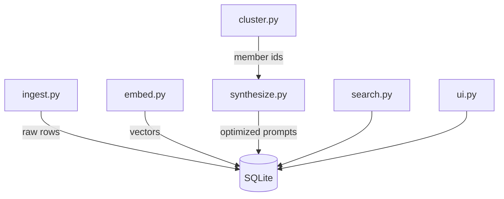

# Architecture Overview

## Modules

- `db.py`: SQLite connection, FTS tables, optional `vec0` (sqlite-vec), helpers (KNN, FTS mirror).
- `ingest.py`: tolerant JSON/JSONL parsing, canonicalization, dedupe, near-dupe gate.
- `embed.py`: OpenAI embeddings for raw/optimized text; inserts vectors into `embeddings`.
- `cluster.py`: per-day greedy grouping using KNN + cosine threshold.
- `synthesize.py`: OpenAI Responses API (Structured Outputs) → validated objects → persistence.
- `search.py`: hybrid FTS ∪ vector search with graceful fallbacks.
- `ui.py`: Streamlit interface; `PDR_DB` selects DB.
- `cli.py`: Typer commands: `ingest`, `synthesize`, `ui`.

## Data Model (day‑1)

- `prompt_raw(id, source_path, role, ts, text, canonical_hash, raw_json)`
- `prompt_optimized(id, kind, title, text_md, variables_json, io_contract_json, rationale, created_at, cluster_hint, gpt_meta_json)`
- `prompt_link(optimized_id, raw_id)`
- FTS: `prompt_raw_fts(text)`, `prompt_opt_fts(text_md)`
- Vec: `embeddings(embedding float[1536], kind text, item_id integer)`

## Fallbacks

- FTS → LIKE when FTS5 unavailable.
- `sqlite-vec` optional; vector features degrade gracefully.
